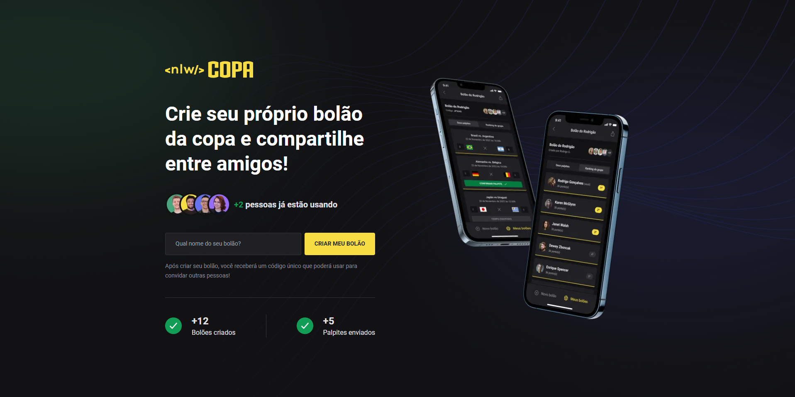
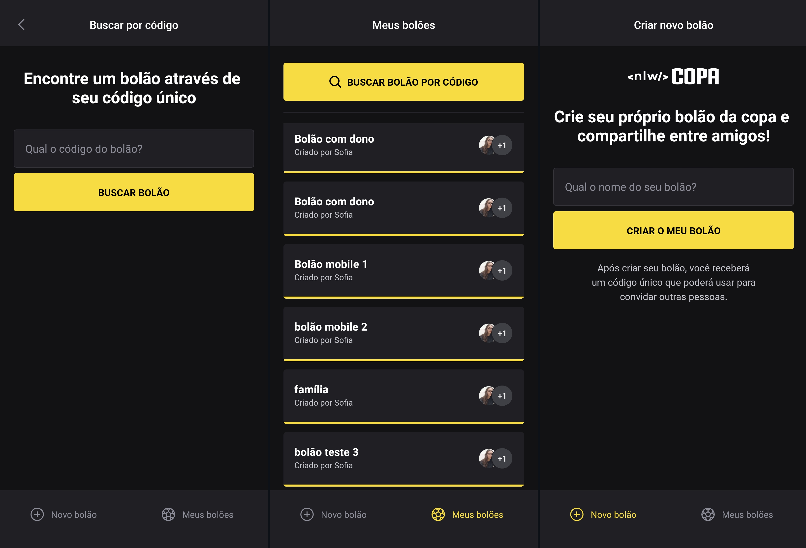

<h1 align="center">
    ⚽ NLW COPA
</h1>

<h3 align="center">App NLW COPA Bolões</h3>

 

  
  

  

## 🥇 Funcionamento

A aplicação, idealizada em TypeScript, conta com um backend feito em Node, utilizando o Fastify para criação das rotas. Para o frontend, utiliza React com estilização em Tailwind. O aplicativo mobile é estruturado React Native e estilizado através do Native Base, tendo maior foco. A aplicação conta, também, com a utilização do Prisma como ORM.

## 🥅 Objetivos

O objetivo da Next Level Week é desenvolver uma aplicação utilizando recursos altamente solicitados pelo mercado, a fim de capacitar o aluno para o trabalho real do dia-a-dia. Durante o período da NLW COPA, tive a oportunidade de participar não só do evento principal mas também da comunidade engajada, que me ajudou diveras vezes com erros que encontrei ao longo do desenvolvimento. No geral, uma experiência incrível e de grande aprendizado!

---

Feito com ♥ by Sofia Rodrigues Ferreira :wave: <a href="https://www.linkedin.com/in/sofiarodfer/">Contato</a>
